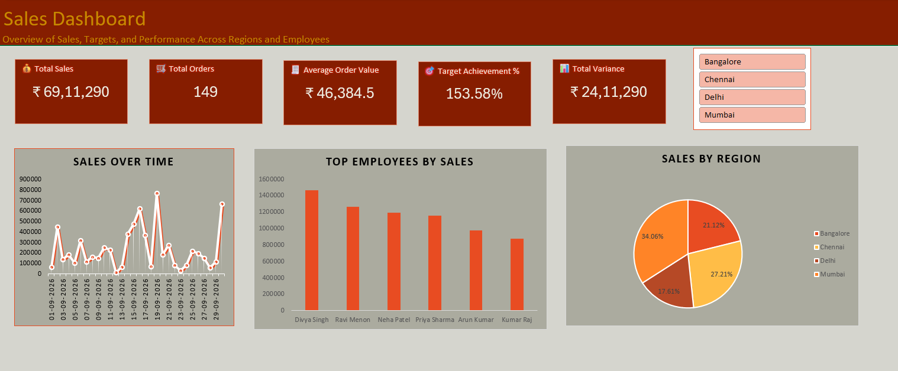

# Sales-Operations-MIS-Dashboard
Excel-based Sales &amp; Operations MIS Dashboard analyzing sales performance, KPIs, employees, and regions.

# Sales & Operations MIS Dashboard

## Project Overview

An Excel-based Sales & Operations MIS Dashboard built to analyze sales
performance across regions, employees, products, and categories.

## Tools Used

- Microsoft Excel
- Power Query
- PivotTables
- PivotCharts
- Excel Dashboard

## Key KPIs

- Total Sales
- Total Orders
- Average Order Value
- Target Achievement %
- Total Variance

## Analysis Performed

- Regional sales performance
- Employee performance
- Product performance
- Category performance
- Payment mode analysis
- Sales contribution
- Target vs actual analysis
- Variance analysis

## Data Preparation

- Data cleaning
- Duplicate handling
- Missing-value handling
- Data standardization
- Data transformation using Power Query

## Dashboard

## Project Objective

The objective of this project was to transform raw sales transaction
data into an interactive MIS dashboard that helps management understand
sales performance and identify areas requiring attention.

## Project File

The complete Excel dashboard is available in:

`Sales_Operations_MIS_Dashboard.xlsx`
